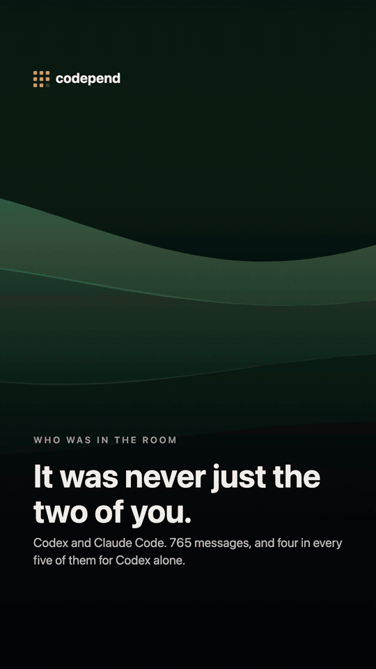

# codepend

### Your coding agent has been keeping a diary about you. This reads it back.

Claude Code, Codex and Cursor write down every session you have with them and never mention it again. Somewhere on your disk is a more complete record of your working life than you could reconstruct from memory.

`codepend` turns it into a photo album.

```sh
npx codepend
```

One command, one HTML page, nothing uploaded. **[See it without installing →](https://shatzibitten.github.io/codepend/)**

[](https://www.npmjs.com/package/codepend)
[](https://nodejs.org)
[](package.json)
[](LICENSE)

<p align="center">
  <a href="https://shatzibitten.github.io/codepend/#/wrapped">
    
  </a>
</p>
<p align="center"><sub>Invented demo data. Your own history never leaves your machine.</sub></p>

---

## What you get back

Not another usage dashboard. A private, browsable story of how you actually work with coding agents:

- **The timeline you forgot.** Your first prompt, longest session, biggest day, late-night stretches, abandoned projects and unexpected returns.
- **Habits hidden across separate chats.** The phrases you repeat, how often you interrupt, when you work, which languages you switch between and how each agent shows up in your work.
- **Where the work went.** Time by project, models and tools used, activity patterns and estimated token cost — with the original moments beside the totals.
- **An ending worth keeping.** Tap through a Wrapped-style story, discover one of twelve coding archetypes, then save a card or export a vertical clip.

Use it as a personal retrospective, a record of a project that consumed a month, or simply a way to notice patterns no single chat can show you.

You do not need a year of history. It is designed to be useful after a week and to become more revealing over time. “On This Day” also brings old moments back throughout the year, so a later run does more than update the totals.

---

## Privacy

The threat here isn't us — nothing is uploaded. It's the screenshot you post thirty seconds later.

- **Nothing leaves the machine.** No network requests, no telemetry, no account. The generated page has no `<script src>`, no `<link href>`, no `fetch`. Turn off your Wi-Fi and run it; that's the version of the test worth trusting.
- **Read-only on your agents' data.** Nothing is ever written back to `~/.claude`, `~/.codex` or Cursor's storage.
- **Secrets stripped by default.** API keys, tokens, private keys, emails, IPs and file paths never reach the page. Real prompts contain pasted credentials — this isn't hypothetical.
- **Zero dependencies.** Nothing to audit but plain JavaScript and the Node standard library.

Posting a screenshot? `--redact paranoid` drops every path, filename and quote first. Details: [`docs/PRIVACY.md`](docs/PRIVACY.md).

---

## Agents

| | | |
|---|---|---|
| **Claude Code** | full | `~/.claude/projects/` |
| **Codex CLI** | full | `~/.codex/sessions/` |
| **Cursor** | full | `state.vscdb`, read-only · needs Node 22.5+ |
| Aider, Cline, Windsurf, Gemini CLI, yours | [good first issue](https://github.com/shatzibitten/codepend/issues) | |

Adding an agent is one file that turns its logs into `Session` objects. Every detector, chart and card then works for free — see [`CONTRIBUTING.md`](CONTRIBUTING.md).

---

## Options

```
-o, --out <path>       where to write the page  (~/.codepend/codepend.html)
    --json <path>      also write the raw payload as JSON
    --since <window>   30d · 6m · 1y · 2026-01-01 · all      (default: all)
    --redact <level>   safe · paranoid · off                (default: safe)
    --wrapped          open straight into Wrapped
    --serve [port]     serve on 127.0.0.1 instead of opening a browser
    --no-open          write the file, don't open anything
    --json-only        only write --json, skip the HTML
    --no-cache         ignore the scan cache, re-read every file
    --no-cursor        skip Cursor (its history lives in a large SQLite db)
    --og-url <url>     where you'll host the page, for the link preview
    --og-image <url>   preview image, if you'd rather not use the default
    --no-og            leave the link-preview tags out entirely
-q, --quiet            errors only
-v, --version          print the version
-h, --help             this

    --claude-dir <dir> where Claude Code keeps sessions        (~/.claude)
    --codex-dir <dir>  where Codex keeps sessions               (~/.codex)
    --cursor-dir <dir> Cursor's User/globalStorage    (needs Node 22.5+)
    --idle-gap <sec>   gap that counts as "away", not "thinking"     (600)
```

```sh
npx codepend --since 90d --wrapped          # the last quarter, as a story
npx codepend --redact paranoid --out ~/share.html
npx codepend --serve                        # WSL, SSH, headless, any box with no browser
npx codepend --json data.json --json-only   # just the numbers, for your own charts
npx codepend --og-url https://you.dev/year   # hosting it? the link will unfurl properly
```

Rescans are cached in `~/.cache/codepend/`, so the second run is instant.

---

## Contributing

Three ways in, easiest first:

- **A language.** Copy one block in [`src/detectors/_stopwords.js`](src/detectors/_stopwords.js). Fourteen ship; the miner already handles scripts without spaces between words.
- **A detector.** Fifteen lines and a new card exists. [`docs/MEMORY-CATALOG.md`](docs/MEMORY-CATALOG.md) has all thirty-one.
- **An agent.** One adapter, and everything else works for free.

Full guide in [`CONTRIBUTING.md`](CONTRIBUTING.md). `node --test`, 367 of them, no dependencies to install.

---

## Acknowledgements

This project began with an idea from [Lance Hankins](https://www.linkedin.com/in/lhankins/). Thank you, Lance, for the spark that started it all.

MIT.
